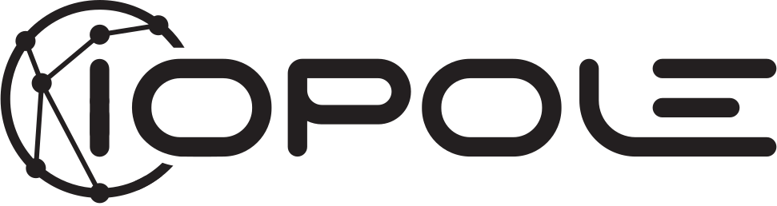

# mcp-einvoice

[](https://jsr.io/@casys/einvoice-core)
[](https://jsr.io/@casys/mcp-einvoice)
[](https://jsr.io/@casys/einvoice-rest)
[](https://www.npmjs.com/package/@casys/einvoice-core)
[](https://www.npmjs.com/package/@casys/mcp-einvoice)
[](https://www.npmjs.com/package/@casys/einvoice-rest)

Serveur MCP pour la facturation électronique — agnostique plateforme via le
pattern adapter.

<p align="center">
  <a href="https://www.iopole.com/contact?utm_medium=affiliate&utm_source=thenocodeguy&utm_campaign=erwan%20lee%20pesle"></a>&nbsp;&nbsp;&nbsp;&nbsp;
  <a href="https://www.storecove.com/"></a>&nbsp;&nbsp;&nbsp;&nbsp;
  <a href="https://www.superpdp.tech/"></a>
</p>

## Pourquoi

La réforme de la facturation électronique en France (sept. 2026) impose
l'utilisation de Plateformes Agréées (PA). Il en existe 106+, chacune avec sa
propre API. Ce serveur MCP expose **une interface unique** pour toutes, avec 39
tools et 6 viewers interactifs.

## Monorepo

Ce dépôt est un Deno workspaces monorepo avec 3 packages :

| Package | Description |
| ------- | ----------- |
| [`@casys/einvoice-core`](packages/core/) | Couche adapter PA-agnostique — types, adapters (Iopole, Storecove, SuperPDP), utils partagés |
| [`@casys/mcp-einvoice`](packages/mcp/) | Serveur MCP — 39 tools, 6 viewers React |
| [`@casys/einvoice-rest`](packages/rest/) | REST API Hono + Swagger UI |

## Installation

### Deno / JSR

```bash
# Adapter layer seul
deno add jsr:@casys/einvoice-core

# Serveur MCP complet
deno add jsr:@casys/mcp-einvoice

# REST API
deno add jsr:@casys/einvoice-rest
```

### Node / npm

```bash
npm install @casys/einvoice-core
npm install @casys/mcp-einvoice
npm install @casys/einvoice-rest
```

## Adapters

|                                                  | Adapter       | Scope               | Tools | Base             |
| ------------------------------------------------ | ------------- | ------------------- | ----- | ---------------- |
|     | **[Iopole](https://www.iopole.com/contact?utm_medium=affiliate&utm_source=thenocodeguy&utm_campaign=erwan%20lee%20pesle)**    | PA française, B2B   | 39/39 | BaseAdapter      |
|  | **[Storecove](https://www.storecove.com/)** | Peppol AP, 40+ pays | 19/39 | BaseAdapter      |
|   | **[Super PDP](https://www.superpdp.tech/)** | PA française, B2B   | 20/39 | AfnorBaseAdapter |

`BaseAdapter` fournit des stubs `NotSupportedError` pour les 45 méthodes de
l'interface `EInvoiceAdapter`. Les PA françaises avec AFNOR héritent
d'`AfnorBaseAdapter` (socle
[AFNOR XP Z12-013](https://norminfo.afnor.org/norme/pr-xp-a00-002/standardisation-api-odpdp/211970))
qui ajoute les opérations flow. Les autres étendent `BaseAdapter` directement.

Le filtrage par `capabilities` assure que le LLM ne voit que les tools supportés
par l'adapter actif.

## Obtenir un compte sandbox

Pour tester, vous avez besoin d'identifiants sandbox auprès d'une plateforme
supportée :

- **[Iopole](https://www.iopole.com/contact?utm_medium=affiliate&utm_source=thenocodeguy&utm_campaign=erwan%20lee%20pesle)** —
  adapter le plus complet (39/39 tools), idéal pour démarrer.
  [Demander un accès sandbox →](https://www.iopole.com/contact?utm_medium=affiliate&utm_source=thenocodeguy&utm_campaign=erwan%20lee%20pesle)
- **[Storecove](https://www.storecove.com/)** — réseau Peppol international
  (40+ pays)
- **[Super PDP](https://www.superpdp.tech/)** — PA française, socle AFNOR

## Configuration rapide

```bash
cp .env.example .env
# Remplir les variables de l'adapter choisi, puis :
deno task mcp:serve     # MCP HTTP mode (port 3015)
```

### MCP config (Claude Desktop / stdio)

```json
{
  "mcpServers": {
    "einvoice": {
      "command": "deno",
      "args": ["run", "--allow-all", "packages/mcp/server.ts"],
      "env": {
        "EINVOICE_ADAPTER": "iopole",
        "IOPOLE_API_URL": "https://api.ppd.iopole.fr/v1",
        "IOPOLE_CLIENT_ID": "...",
        "IOPOLE_CLIENT_SECRET": "...",
        "IOPOLE_CUSTOMER_ID": "..."
      }
    }
  }
}
```

Remplacer `EINVOICE_ADAPTER` par `storecove` ou `superpdp` avec les variables
correspondantes (voir `.env.example`).

### Options serveur MCP

```
--http                   Mode HTTP (default: stdio)
--port=3015              Port HTTP
--hostname=localhost     Bind address (default: localhost)
--adapter=iopole         Override adapter (default: env EINVOICE_ADAPTER)
--categories=invoice     Filtrer les catégories de tools
```

## REST API

```bash
deno task rest:serve     # REST API (port 3016)
```

- Swagger UI disponible sur `http://localhost:3016/docs`
- Auth via header `X-API-Key` (env `EINVOICE_REST_API_KEY`)
- `--no-auth` pour désactiver l'auth en dev
- Même couche adapter que le serveur MCP — mêmes credentials `.env`

## Commands

```bash
deno task mcp:serve      # MCP HTTP mode (port 3015)
deno task rest:serve     # REST API (port 3016)
deno task test           # Tous les tests (tous packages)
deno task test:core      # Tests einvoice-core
deno task test:mcp       # Tests mcp-einvoice
deno task test:rest      # Tests einvoice-rest
deno task inspect        # MCP Inspector
cd packages/mcp/src/ui && node build-all.mjs   # Rebuild viewers après modif TSX
```

## Architecture

```
┌───────────────────────────────────────────────┐
│  39 MCP Tools (einvoice_*)                    │
│  invoice · directory · status · reporting     │
│  webhook · config                             │
├───────────────────────────────────────────────┤
│  6 MCP Apps (viewers React)                   │
│  invoice · doclist · timeline · card ·        │
│  directory-list · action                      │
├───────────────────────────────────────────────┤
│  EInvoiceAdapter (interface, 45 methods)      │
│  + capabilities → filtrage tools dynamique    │
├──────────┬────────────────────────────────────┤
│ BaseAdapter (abstract, NotSupported stubs)    │
├──────────┼────────────────────────────────────┤
│ AfnorBase│ Direct                             │
│ (AFNOR)  │                                    │
│ ┌──────┐ │ ┌─────────┐  ┌───────────┐        │
│ │ SPDP │ │ │ Iopole  │  │ Storecove │        │
│ └──────┘ │ └─────────┘  └───────────┘        │
└──────────┴────────────────────────────────────┘
```

## Tools

| Catégorie         | Tools                                                                                                                                                                                                                                                                                      |
| ----------------- | ------------------------------------------------------------------------------------------------------------------------------------------------------------------------------------------------------------------------------------------------------------------------------------------ |
| **invoice** (11)  | submit, search, get, download, download_readable, files, attachments, download_file, generate_cii, generate_ubl, generate_facturx                                                                                                                                                          |
| **directory** (3) | fr_search, int_search, peppol_check                                                                                                                                                                                                                                                        |
| **status** (2)    | send, history                                                                                                                                                                                                                                                                              |
| **reporting** (2) | invoice_transaction, transaction                                                                                                                                                                                                                                                           |
| **webhook** (5)   | list, get, create, update, delete                                                                                                                                                                                                                                                          |
| **config** (16)   | customer_id, entities_list, entity_get, entity_create_legal, entity_create_office, enroll_fr, entity_claim, entity_delete, network_register, network_register_by_id, network_unregister, identifier_create, identifier_create_by_scheme, identifier_delete, entity_configure, claim_delete |

Tous préfixés `einvoice_<category>_`. Chaque tool déclare ses `requires` — seuls
ceux supportés par l'adapter actif sont exposés au LLM.

### Flow generate → preview → submit

1. `generate_*` → stocke le fichier, retourne `generated_id` + preview viewer
2. Le viewer affiche la facture avec bouton "Déposer"
3. `submit` consomme le `generated_id` (ou accepte `file_base64` direct)

## Viewers (MCP Apps)

| Viewer              | Usage                                                      |
| ------------------- | ---------------------------------------------------------- |
| **invoice-viewer**  | Facture détaillée + actions (accepter, rejeter, déposer)   |
| **doclist-viewer**  | Table avec drill-down, recherche, filtres direction/statut |
| **status-timeline** | Timeline verticale des changements de statut               |
| **directory-card**  | Fiche entreprise (SIREN/SIRET, réseaux)                    |
| **directory-list**  | Résultats annuaire — cartes avec expand, recherche client  |
| **action-result**   | Feedback visuel d'action (enroll, register)                |

```bash
cd packages/mcp/src/ui && node build-all.mjs   # Rebuild après modification TSX
```

## Ajouter un adapter

**PA française avec AFNOR** → `extends AfnorBaseAdapter` (socle AFNOR gratuit,
override le natif) :

```typescript
export class MyPAAdapter extends AfnorBaseAdapter {
  readonly name = "my-pa";
  readonly capabilities = new Set(["emitInvoice", "searchInvoices", ...]);
  private client: MyPAClient;

  constructor(client: MyPAClient, afnor: AfnorClient | null) {
    super(afnor);  // ou super(null) si pas encore d'AFNOR
    this.client = client;
  }

  override async generateCII(req) { return this.client.convert(req); }
  // ... override les extras, hériter le reste
}
```

**PA française sans AFNOR** → `extends BaseAdapter` (override toutes les
méthodes avec l'API native, comme Iopole).

**Plateforme non-française** → `extends BaseAdapter` directement (comme
Storecove).

Guide complet : `packages/core/src/adapters/README.md`.

## Structure

```
packages/
├── core/                        # @casys/einvoice-core
│   ├── mod.ts
│   └── src/
│       ├── adapter.ts           # EInvoiceAdapter (45 methods + capabilities)
│       ├── adapters/
│       │   ├── base-adapter.ts  # BaseAdapter (abstract, NotSupported stubs)
│       │   ├── afnor/           # Socle AFNOR XP Z12-013 (shared)
│       │   │   ├── base-adapter.ts  # AfnorBaseAdapter (extends BaseAdapter)
│       │   │   └── client.ts        # AfnorClient (3 flow endpoints)
│       │   ├── shared/oauth2.ts # OAuth2 token provider (shared)
│       │   ├── iopole/          # PA française — extends BaseAdapter
│       │   ├── storecove/       # Peppol AP — extends BaseAdapter
│       │   └── superpdp/        # PA française — extends AfnorBaseAdapter
│       └── testing/helpers.ts   # createMockAdapter()
├── mcp/                         # @casys/mcp-einvoice
│   ├── server.ts                # MCP server (stdio + HTTP)
│   ├── mod.ts
│   └── src/
│       ├── client.ts            # Tools registry + capability filtering
│       ├── tools/               # 39 tools (6 catégories)
│       ├── ui/                  # 6 viewers React (single-file HTML)
│       └── testing/helpers.ts   # unwrapStructured()
└── rest/                        # @casys/einvoice-rest
    ├── server.ts                # Hono REST server
    └── src/
        └── routes/              # Routes (invoice, config, entity, etc.)
```
